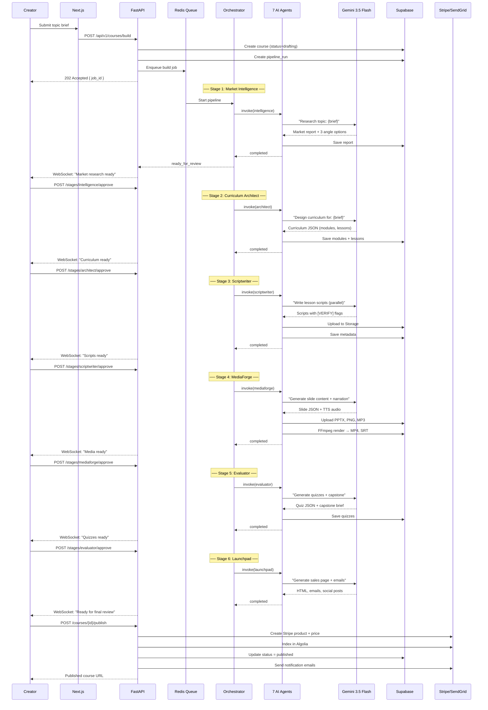
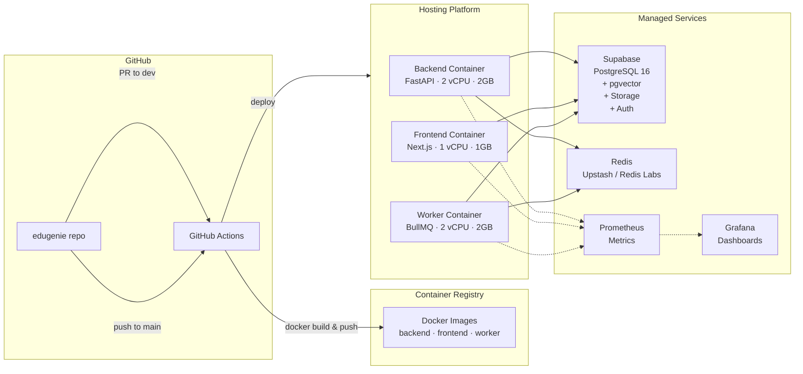

# EduGenie OS — High-Level Design (HLD)

> **Version:** 0.2.0  
> **Stack:** FastAPI · Next.js · Expo · LangGraph · Gemini 3.5 Flash · Supabase  
> **Last Updated:** 2026-05-27

---

## Table of Contents

1. [System Overview](#1-system-overview)
2. [Request-Response Flow: AI Agent Pipeline](#2-request-response-flow-ai-agent-pipeline)
3. [External Integrations](#3-external-integrations)
4. [Deployment Topology](#4-deployment-topology)

---

## 1. System Overview

EduGenie OS is an AI-powered course creation platform. A creator submits a topic brief; the system autonomously builds curriculum, scripts, slides, voice, video, quizzes, and a sales page — then publishes a live product with Stripe checkout.

### Architecture Diagram

```mermaid
graph TB
    subgraph Clients["Client Layer"]
        WEB[Next.js Web App<br/>Creator OS / LearnSpace]
        MOBILE[Expo Mobile App<br/>React Native]
    end

    subgraph Compute["Compute Layer (Docker)"]
        FE[Next.js Frontend<br/>SSR · API Routes · Static]
        API[FastAPI Backend<br/>REST · WebSocket · Middleware]
        WK[Background Workers<br/>BullMQ · FFmpeg · Agents]
    end

    subgraph AI["AI Agent Layer (LangGraph Supervisor)"]
        ORCH[Orchestrator<br/>State Machine · Checkpointing]
        INTEL[Intelligence<br/>Market Research]
        ARCH[Architect<br/>Curriculum Design]
        SCRIPT[Scriptwriter<br/>Lesson Scripts]
        MEDIA[MediaForge<br/>Slides · Voice · Video]
        EVAL[Evaluator<br/>Quizzes · Capstone]
        LAUNCH[Launchpad<br/>Sales Page · Emails]
        OPT[Optimizer<br/>Post-Launch Analytics]
    end

    subgraph Gemini["AI Provider"]
        GM35[Gemini 3.5 Flash<br/>Text · Code · Reasoning · TTS · STT]
        EMB2[Gemini Embedding 2<br/>1536d Embeddings]
    end

    subgraph Supabase["Unified Backend (Supabase)"]
        PG[(PostgreSQL 16<br/>+ pgvector)]
        STO[Supabase Storage<br/>Videos · Slides · Scripts]
        SA[Supabase Auth<br/>JWT · OAuth · Magic Link]
    end

    subgraph Cache["Cache & Queue"]
        REDIS[(Redis<br/>Sessions · Queue · Cache)]
    end

    subgraph External["External Services"]
        STRIPE[Stripe<br/>Payments · Connect · Tax]
        SENDGRID[SendGrid<br/>Transactional Email]
        TWILIO[Twilio<br/>WhatsApp]
        ALGOLIA[Algolia<br/>Search Index]
        POSTHOG[PostHog<br/>Analytics]
    end

    subgraph Observability["Observability"]
        PROM[Prometheus<br/>Metrics]
        GRAF[Grafana<br/>Dashboards · Alerts]
    end

    %% Client → Compute
    WEB --> FE
    WEB --> API
    MOBILE --> API

    %% Compute internal
    FE -->|BFF calls| API
    API -->|Enqueue| WK

    %% Compute → AI
    API --> ORCH
    WK --> ORCH
    ORCH --> INTEL & ARCH & SCRIPT & MEDIA & EVAL & LAUNCH & OPT

    %% AI → Gemini
    INTEL --> GM35
    ARCH --> GM35
    SCRIPT --> GM35
    MEDIA --> GM35
    EVAL --> GM35
    LAUNCH --> GM35
    OPT --> GM35

    %% Embeddings
    INTEL --> EMB2
    ARCH --> EMB2

    %% Compute → Supabase
    API --> PG
    API --> STO
    API --> SA
    WK --> PG
    WK --> STO

    %% Compute → Cache
    API --> REDIS
    WK --> REDIS

    %% Compute → External
    API --> STRIPE
    API --> SENDGRID
    API --> TWILIO
    API --> ALGOLIA
    API --> POSTHOG
    WK --> SENDGRID
    WK --> TWILIO

    %% Monitoring
    API -.-> PROM
    WK -.-> PROM
    PROM -.-> GRAF

    %% Styles
    classDef compute fill:#2d3748,color:#fff,stroke:#4a5568
    classDef ai fill:#1a365d,color:#fff,stroke:#2b6cb0
    classDef gemini fill:#1c4532,color:#fff,stroke:#276749
    classDef supabase fill:#44337a,color:#fff,stroke:#553c9a
    classDef cache fill:#744210,color:#fff,stroke:#975a16
    classDef ext fill:#3c366b,color:#fff,stroke:#5a4f8b
    classDef obs fill:#742a2a,color:#fff,stroke:#9b2c2c
    class FE,API,WK compute
    class ORCH,INTEL,ARCH,SCRIPT,MEDIA,EVAL,LAUNCH,OPT ai
    class GM35,EMB2 gemini
    class PG,STO,SA supabase
    class REDIS cache
    class STRIPE,SENDGRID,TWILIO,ALGOLIA,POSTHOG ext
    class PROM,GRAF obs
```



### Core Technology Decisions

| Decision | Choice | Rationale |
|----------|--------|-----------|
| **LLM Provider** | Gemini 3.5 Flash | Single model for all text, code, TTS, STT; lower latency than multi-model |
| **Unified Backend** | Supabase | DB (PostgreSQL 16 + pgvector), Storage, Auth — single API, RLS, real-time |
| **Agent Framework** | LangGraph | State machine with checkpointing, parallel execution, built-in retry |
| **Queue** | Redis + BullMQ | Lightweight, no Kafka overhead; Kafka added only if event streaming needed |
| **CI/CD** | GitHub Actions | Native GitHub integration; no separate CI/CD platform needed |
| **Monitoring** | Prometheus + Grafana | Open-source, no vendor lock-in, works with any Docker host |
| **Data Processing** | Raw Python | No pandas/duckdb overhead; CSV/Excel → JSON or direct to Postgres |

---

## 2. Request-Response Flow: AI Agent Pipeline

### Course Build Lifecycle



### WebSocket Event Stream

All pipeline progress is streamed to the creator in real-time:

```text
Client → WS /ws/pipeline/{job_id}
Server → { "stage": "intelligence", "status": "running",  "progress": 45 }
Server → { "stage": "intelligence", "status": "complete" }
Server → { "stage": "architect",    "status": "running",  "progress": 10 }
```

---

## 3. External Integrations

### Stripe (Payments)

| Operation | API Used | Flow |
|-----------|----------|------|
| Course purchase | Checkout Session | Creator publish → Stripe product created → Student buys via Checkout |
| Creator payouts | Connect Express | Creator onboarded via OAuth → Bi-weekly payouts ($25 min) |
| Platform fee | 5–12% auto-deduction | Stripe Take-off rate or application fee |
| Tax | Stripe Tax | Auto-calculate VAT/GST for EU transactions |
| Coupons | Stripe Coupons | Percent/fixed, max uses, validity window |

**Webhook endpoints handled:**
- `checkout.session.completed` → enroll student, send confirmation
- `payment_intent.payment_failed` → notify student, retry logic
- `charge.refunded` → reverse enrollment, revoke access
- `payout.paid` → notify creator

### SendGrid (Email)

| Email Type | Trigger | Template |
|------------|---------|----------|
| Welcome | User signup | Onboarding sequence (3 emails) |
| Course published | Creator publishes | Congratulations + marketplace tips |
| Enrollment confirmation | Student purchases | Course link, receipt |
| Launch sequence | Course goes live | 6 automated emails (welcome, module 1, midpoint, final, certificate, upsell) |
| Weekly digest | Optimizer report | Creator analytics summary |
| Affiliate commission | Conversion earned | Amount, course, link |

### Twilio (WhatsApp)

| Message Type | Trigger | Template |
|-------------|---------|----------|
| Enrollment confirmed | Student enrolls | "You're enrolled in {course}! Start: {link}" |
| Certificate earned | Course completed | "You earned a certificate! View: {link}" |
| Course updated | Creator publishes update | "{course} updated — check out what's new" |
| Payment receipt | Purchase completes | "Payment confirmed for {course}. Amount: ${amt}" |
| Engagement reminder | 3 days inactive | "You haven't visited {course} in 3 days. Continue: {link}" |

### Algolia (Search)

- Index: `edugenie_courses`
- Searchable attributes: title, description, creator_name, tags
- Faceting: category, price_range, language, difficulty, rating
- AI recommendations via pgvector similarity (fallback to Algolia trending)

---

## 4. Deployment Topology



### CI/CD Workflow (GitHub Actions)

| Event | Jobs | Outcome |
|-------|------|---------|
| PR to `development` | Backend lint + typecheck + test | Quality gate |
| PR to `development` | Frontend lint + typecheck + build | Quality gate |
| Push to `main` | All of above + Docker build/push + deploy | Production release (manual approval gate) |
