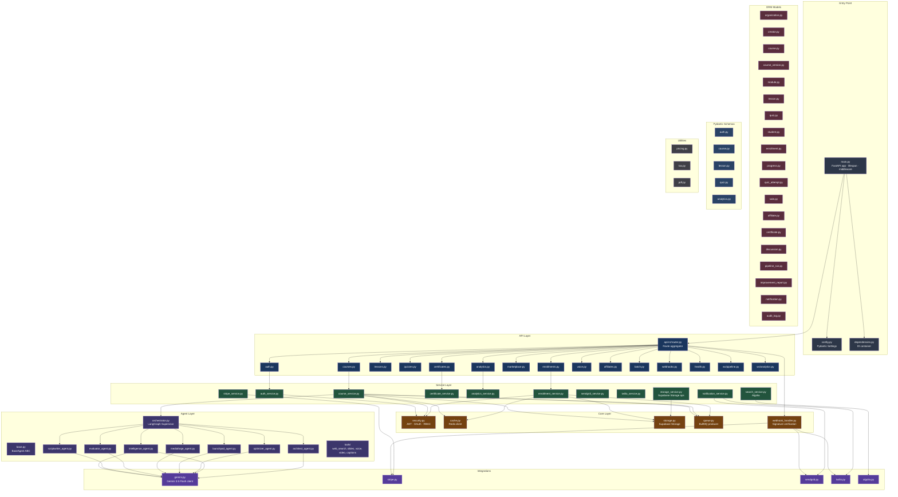
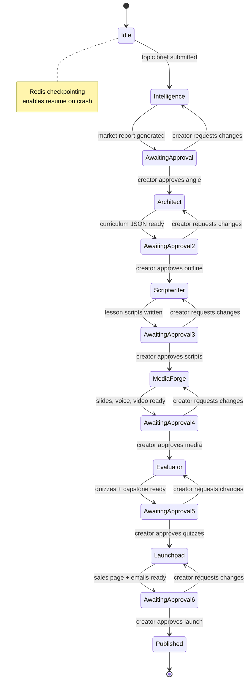
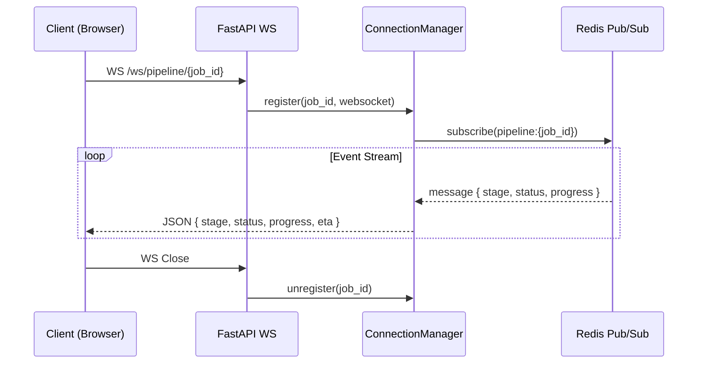

# EduGenie OS — Low-Level Design (LLD)

> **Version:** 0.2.0  
> **Stack:** FastAPI · Pydantic v2 · SQLAlchemy 2.0 async · LangGraph · Gemini 3.5 Flash  
> **Last Updated:** 2026-05-27

---

## Table of Contents

1. [Backend Module Architecture](#1-backend-module-architecture)
2. [LangGraph Supervisor Pattern (7 Agents)](#2-langgraph-supervisor-pattern-7-agents)
3. [Directory Structure & Module Map](#3-directory-structure--module-map)
4. [Agent-to-Module Interactions](#4-agent-to-module-interactions)
5. [WebSocket Event Bus](#5-websocket-event-bus)
6. [Config & Dependency Injection](#6-config--dependency-injection)
7. [Error Handling & Resilience](#7-error-handling--resilience)

---

## 1. Backend Module Architecture



---

## 2. LangGraph Supervisor Pattern (7 Agents)

### Agent State Machine



### Orchestrator Implementation Details

```python
# Pseudocode for the orchestrator state graph (LangGraph)

class PipelineState(TypedDict):
    course_id: str
    topic_brief: dict
    stage: str
    status: str
    market_report: Optional[dict]
    curriculum: Optional[dict]
    scripts: Optional[dict]
    media: Optional[dict]
    quizzes: Optional[dict]
    launch: Optional[dict]
    errors: list[str]
    cost_usd: float

# Define the state graph
builder = StateGraph(PipelineState)

# Add nodes (each agent is a LangGraph node)
builder.add_node("intelligence", IntelligenceAgent.run)
builder.add_node("architect", ArchitectAgent.run)
builder.add_node("scriptwriter", ScriptwriterAgent.run)
builder.add_node("mediaforge", MediaForgeAgent.run)
builder.add_node("evaluator", EvaluatorAgent.run)
builder.add_node("launchpad", LaunchpadAgent.run)
builder.add_node("publish", publish_course)

# Add edges with review gates as conditional edges
builder.add_edge("intelligence", "architect")       # after approval
builder.add_edge("architect", "scriptwriter")
builder.add_edge("scriptwriter", "mediaforge")
builder.add_edge("mediaforge", "evaluator")
builder.add_edge("evaluator", "launchpad")
builder.add_edge("launchpad", "publish")

# Checkpoint every step (Redis-backed)
builder.compile(checkpointer=RedisCheckpointer(redis_client))
```

### Agent Base Class

```python
class BaseAgent(ABC):
    """Every agent extends this."""

    agent_name: str
    model: GenerativeModel  # Gemini 3.5 Flash

    @abstractmethod
    async def run(self, state: PipelineState) -> PipelineState:
        """Execute the agent's task. Returns updated state."""
        ...

    async def _call_gemini(self, prompt: str, schema: type[BaseModel] | None = None) -> str:
        """Unified Gemini call with optional structured output."""
        response = await self.model.generate_content_async(prompt)
        self._track_cost(response.usage_metadata)
        return response.text

    def _track_cost(self, usage) -> None:
        tokens = usage.prompt_token_count + usage.candidates_token_count
        cost = (tokens / 1_000_000) * GEMINI_COST_PER_MTOKEN
        Prometheus.cost_histogram.labels(agent=self.agent_name).observe(cost)
```

### Agent Responsibilities & Gemini Model Usage

| Agent | Input | Gemini Capability | Output | Avg Tokens |
|-------|-------|-------------------|--------|------------|
| Intelligence | topic brief | Text generation + web search | Market report JSON | ~4K |
| Architect | approved brief | Text generation | Curriculum JSON | ~3K |
| Scriptwriter | curriculum | Text generation (parallel per lesson) | Lesson scripts markdown | ~8K |
| MediaForge | scripts | Text generation + TTS | Slide JSON + MP3 + MP4 | ~6K + audio |
| Evaluator | course data | Text generation | Quiz JSON + capstone brief | ~3K |
| Launchpad | full course | Text generation | Sales HTML + emails | ~5K |
| Optimizer | analytics | Text generation | Improvement report | ~2K |

---

## 3. Directory Structure & Module Map

```
backend/
├── app/
│   ├── __init__.py
│   ├── main.py                  # FastAPI app, lifespan, CORS, middleware
│   ├── config.py                # Pydantic Settings (env → Python)
│   ├── dependencies.py          # get_db, get_current_user, get_redis
│   │
│   ├── api/
│   │   ├── __init__.py
│   │   ├── v1/
│   │   │   ├── __init__.py
│   │   │   ├── router.py        # include_router for all endpoints
│   │   │   ├── auth.py          # signup, login, magic-link, refresh, me
│   │   │   ├── courses.py       # CRUD, build, publish, pipeline status
│   │   │   ├── creators.py      # profile, courses list, revenue
│   │   │   ├── lessons.py       # script, video, slides (signed URLs)
│   │   │   ├── quizzes.py       # list, update, attempt, results
│   │   │   ├── enrollments.py   # create, progress, complete
│   │   │   ├── certificates.py  # generate, verify
│   │   │   ├── marketplace.py   # search, recommendations, detail
│   │   │   ├── analytics.py     # overview, lessons, quizzes, improvement
│   │   │   ├── voice.py         # train, list, test, delete voice models
│   │   │   ├── affiliates.py    # create link, stats, payouts
│   │   │   ├── batch.py         # submit CSV, status, retry
│   │   │   ├── webhooks.py      # stripe, sendgrid, twilio
│   │   │   └── health.py        # /health, /health/detailed
│   │   │
│   │   └── ws/
│   │       ├── __init__.py
│   │       ├── pipeline.py      # WS /ws/pipeline/{job_id}/live
│   │       └── analytics.py     # WS /ws/analytics/{course_id}
│   │
│   ├── core/
│   │   ├── __init__.py
│   │   ├── security.py          # JWT encode/decode, password hash, RBAC
│   │   ├── cache.py             # Redis client (get/set/delete with TTL)
│   │   ├── storage.py           # Supabase Storage client (upload, signed URL)
│   │   ├── queue.py             # BullMQ producer (enqueue jobs)
│   │   └── webhook_handler.py   # Stripe/Twilio/SendGrid signature verify
│   │
│   ├── models/                  # SQLAlchemy 2.0 async ORM models
│   │   ├── __init__.py
│   │   ├── organization.py
│   │   ├── creator.py
│   │   ├── course.py
│   │   ├── course_version.py
│   │   ├── module.py
│   │   ├── lesson.py
│   │   ├── quiz.py
│   │   ├── student.py
│   │   ├── enrollment.py
│   │   ├── progress.py
│   │   ├── quiz_attempt.py
│   │   ├── sale.py
│   │   ├── affiliate.py
│   │   ├── certificate.py
│   │   ├── discussion.py
│   │   ├── pipeline_run.py
│   │   ├── improvement_report.py
│   │   ├── notification.py
│   │   └── audit_log.py
│   │
│   ├── schemas/                 # Pydantic v2 request/response schemas
│   │   ├── __init__.py
│   │   ├── auth.py
│   │   ├── course.py
│   │   ├── lesson.py
│   │   ├── quiz.py
│   │   └── analytics.py
│   │
│   ├── services/                # Business logic
│   │   ├── __init__.py
│   │   ├── auth_service.py
│   │   ├── course_service.py
│   │   ├── enrollment_service.py
│   │   ├── certificate_service.py
│   │   ├── analytics_service.py
│   │   ├── stripe_service.py
│   │   ├── sendgrid_service.py
│   │   ├── twilio_service.py
│   │   ├── notification_service.py
│   │   ├── search_service.py
│   │   └── storage_service.py
│   │
│   ├── agents/
│   │   ├── __init__.py
│   │   ├── base.py              # BaseAgent abstract class
│   │   ├── orchestrator.py      # LangGraph supervisor state graph
│   │   ├── intelligence_agent.py
│   │   ├── architect_agent.py
│   │   ├── scriptwriter_agent.py
│   │   ├── mediaforge_agent.py
│   │   ├── evaluator_agent.py
│   │   ├── launchpad_agent.py
│   │   ├── optimizer_agent.py
│   │   └── tools/
│   │       ├── __init__.py
│   │       ├── web_search.py    # Google Custom Search + Bing
│   │       ├── competitor_scrape.py
│   │       ├── slides.py        # python-pptx renderer
│   │       ├── voice.py         # Gemini TTS + ElevenLabs
│   │       ├── video.py         # FFmpeg wrapper
│   │       └── captions.py      # SRT generation
│   │
│   ├── integrations/
│   │   ├── __init__.py
│   │   ├── gemini.py            # Gemini 3.5 Flash client (text, TTS, STT, embeddings)
│   │   ├── stripe.py
│   │   ├── sendgrid.py
│   │   ├── twilio.py
│   │   ├── algolia.py
│   │   └── elevenlabs.py        # Optional voice cloning
│   │
│   └── utils/
│       ├── __init__.py
│       ├── pricing.py
│       ├── tax.py
│       └── pdf.py               # Certificate PDF/PNG generation
│
├── alembic/                     # Database migrations
│   ├── env.py
│   └── versions/
│       └── 001_initial.py
│
├── tests/
│   ├── conftest.py
│   ├── unit/
│   │   ├── test_agents.py
│   │   ├── test_services.py
│   │   └── test_utils.py
│   ├── integration/
│   │   ├── test_pipeline.py
│   │   └── test_api.py
│   └── e2e/
│       └── test_full_build.py
│
├── requirements/
│   ├── base.txt
│   ├── dev.txt
│   └── prod.txt
│
├── pyproject.toml
├── Dockerfile
└── alembic.ini
```

---

## 4. Agent-to-Module Interactions

### Interaction Matrix

```mermaid
graph TB
    subgraph Agents
        INTEL[intelligence_agent]
        ARCH[architect_agent]
        SCRIPT[scriptwriter_agent]
        MEDIA[mediaforge_agent]
        EVAL[evaluator_agent]
        LAUNCH[launchpad_agent]
        OPT[optimizer_agent]
    end

    subgraph Tools
        WS[web_search]
        CS[competitor_scrape]
        SL[slides]
        VO[voice]
        VI[video]
        CAP[captions]
    end

    subgraph Integrations
        GM[gemini.py]
        ST[stripe.py]
        SG[sendgrid.py]
        TW[twilio.py]
        AL[algolia.py]
    end

    subgraph Models
        CRS[course]
        MOD[module]
        LSN[lesson]
        QZ[quiz]
        PR[pipeline_run]
        IMP[improvement_report]
        ENR[enrollment]
        PROG[progress]
    end

    subgraph Services
        CSVC[course_service]
        SSVC[storage_service]
        NSVC[notification_service]
    end

    %% Agent → Tool edges
    INTEL --> WS & CS
    SCRIPT --> SL
    MEDIA --> SL & VO & VI & CAP

    %% Agent → Integration edges
    INTEL --> GM
    ARCH --> GM
    SCRIPT --> GM
    MEDIA --> GM
    EVAL --> GM
    LAUNCH --> GM
    OPT --> GM

    %% Agent → ORM edges
    INTEL --> PR
    ARCH --> MOD & LSN
    SCRIPT --> LSN & PR
    MEDIA --> LSN & PR
    EVAL --> QZ & PR
    LAUNCH --> PR
    OPT --> IMP & PROG & ENR

    %% Agent → Service edges
    MEDIA --> SSVC
    LAUNCH --> CSVC & NSVC
    OPT --> NSVC

    %% Service → Integration edges
    CSVC --> ST & SG & AL
    NSVC --> SG & TW

    %% Styles
    classDef agent fill:#3c366b,color:#fff
    classDef tool fill:#553c9a,color:#fff
    classDef integ fill:#2b6cb0,color:#fff
    classDef model fill:#5a2d3c,color:#fff
    classDef svc fill:#22543d,color:#fff
```



### Agent Lifecycle Hook Points

| Hook | Called When | Purpose |
|------|-------------|---------|
| `agent.on_start(state)` | Before agent runs | Validate input, emit WebSocket event |
| `agent.run(state)` | Agent execution | Core logic |
| `agent.on_complete(state)` | After success | Emit WebSocket, save metrics |
| `agent.on_error(state, err)` | On failure | Log error, retry or fail pipeline |
| `agent.on_approve(state)` | Creator approves | Unblock next stage |
| `agent.on_regenerate(state, instructions)` | Creator requests changes | Rerun agent with new instructions |

---

## 5. WebSocket Event Bus

### Connection Lifecycle



### Event Payload Format

```json
{
  "event": "stage_update",
  "job_id": "uuid",
  "stage": "scriptwriter",
  "status": "running",
  "progress": 65,
  "eta_seconds": 120,
  "model": "gemini-3.5-flash",
  "cost_usd": 0.042
}
```

---

## 6. Config & Dependency Injection

### Settings (config.py)

```python
class Settings(BaseSettings):
    environment: str = "development"

    # Supabase (Unified)
    supabase_url: str
    supabase_service_role_key: str
    supabase_anon_key: str

    # Gemini
    gemini_api_key: str

    # Stripe
    stripe_secret_key: str
    stripe_webhook_secret: str
    stripe_connect_client_id: str

    # SendGrid
    sendgrid_api_key: str

    # Twilio
    twilio_account_sid: str
    twilio_auth_token: str
    twilio_whatsapp_number: str

    # Redis
    redis_url: str = "redis://localhost:6379/0"

    # Algolia
    algolia_app_id: str | None = None
    algolia_api_key: str | None = None
    algolia_index_name: str = "edugenie_courses"

    model_config = SettingsConfigDict(env_file=".env")
```

### DI Container (dependencies.py)

```python
async def get_db() -> AsyncGenerator[AsyncSession, None]:
    async with async_session() as session:
        yield session

async def get_current_user(
    token: str = Depends(oauth2_scheme),
    db: AsyncSession = Depends(get_db),
) -> User:
    payload = decode_jwt(token)
    user = await db.get(User, payload["sub"])
    if not user:
        raise HTTPException(401)
    return user

def get_redis() -> Redis:
    return redis_client

def get_gemini() -> GenerativeModel:
    return GenerativeModel("gemini-3.5-flash")
```

---

## 7. Error Handling & Resilience

### Retry Policy

| Agent | Max Retries | Backoff | Timeout |
|-------|-------------|---------|---------|
| Intelligence | 2 | 5s | 60s |
| Architect | 2 | 5s | 60s |
| Scriptwriter | 3 | 10s | 120s |
| MediaForge | 3 | 10s | 300s |
| Evaluator | 2 | 5s | 60s |
| Launchpad | 2 | 5s | 60s |
| Optimizer | 2 | 5s | 60s |

### Error Categories

| Error Type | Handling | User Impact |
|------------|----------|-------------|
| Gemini API timeout | Retry up to 3x, then fail stage | "Stage failed — try again" |
| Supabase connection lost | Reconnect with backoff | Temporary latency |
| Redis down | Degraded mode (no queue/WS) | No real-time progress |
| Stripe webhook failure | Queue retry until processed | Delayed enrollment |
| Invalid AI output | Schema validation → regenerate | "Unexpected output — regenerating" |
