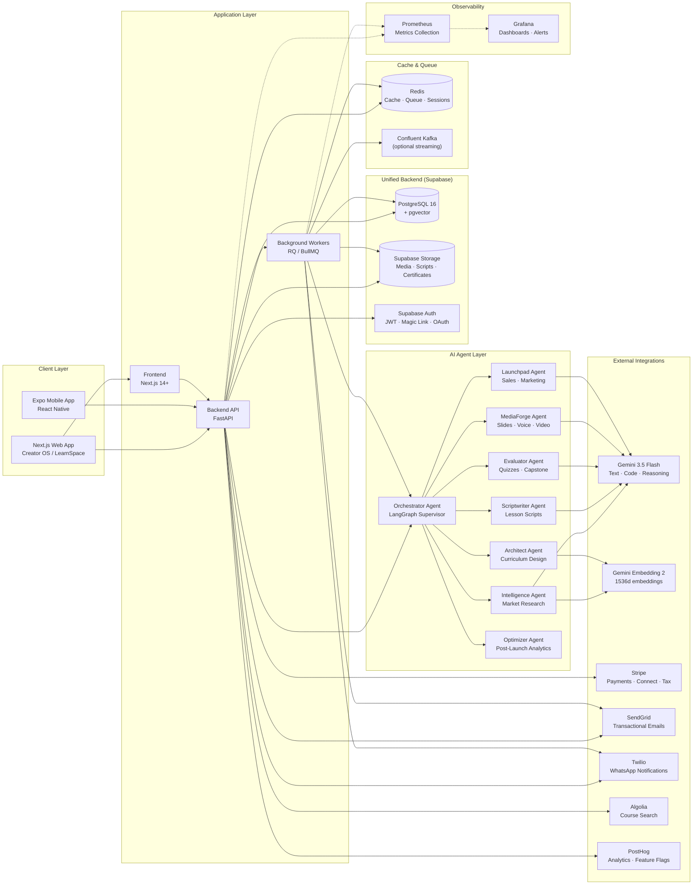
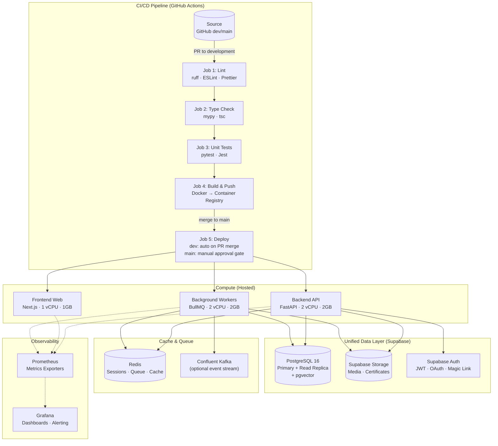
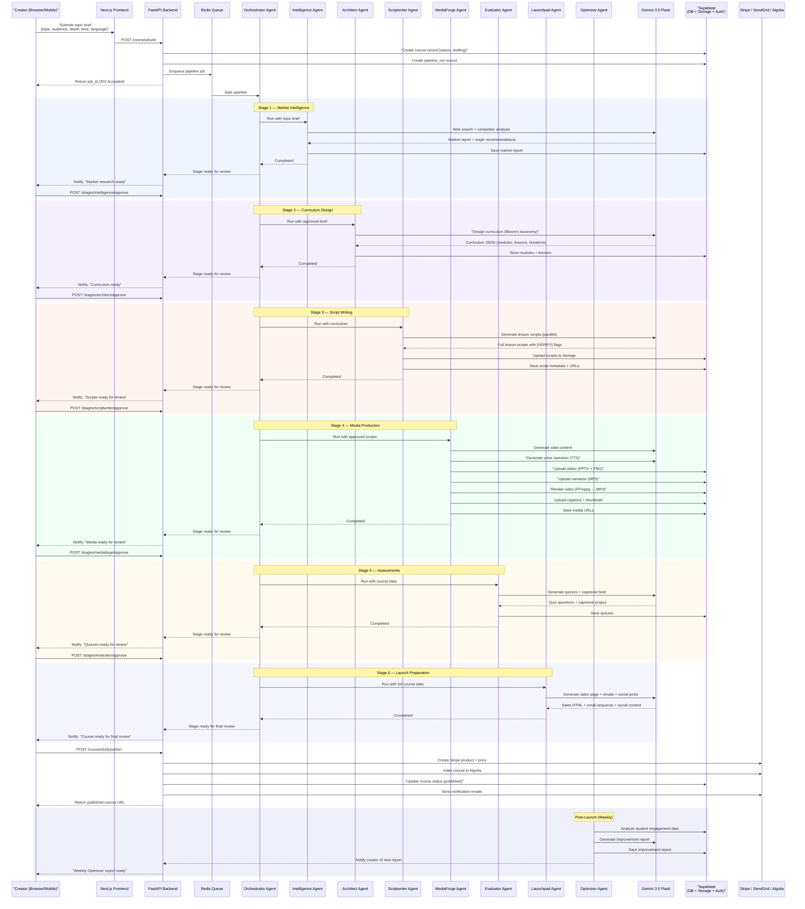

# EduGenie OS — System Architecture

> **Version:** 0.2.0  
> **Last Updated:** 2026-05-27  
> **Stack:** FastAPI · Next.js · Expo · LangGraph · Gemini 3.5 Flash · Supabase

---

## Table of Contents

1. [High-Level System Architecture](#1-high-level-system-architecture)
2. [Infrastructure & Deployment Pipeline](#2-infrastructure--deployment-pipeline)
3. [Core AI Workflow](#3-core-ai-workflow)
4. [Database Entity Relationship](#4-database-entity-relationship)
5. [Technology Stack Reference](#5-technology-stack-reference)

---

## 1. High-Level System Architecture

This diagram illustrates the complete network topology — from user-facing clients through the application layer, into the unified Supabase backend, and out to external integrations.

---

## 2. Infrastructure & Deployment Pipeline

This diagram maps the deployment topology alongside the GitHub Actions CI/CD pipeline.

---

## 3. Core AI Workflow

This sequence diagram traces a complete course build request from the moment a creator submits a topic brief through the AI agent pipeline, review gates, and final publication.

---

## 4. Database Entity Relationship

This diagram presents the core database schema — the primary tables and their relationships within the Supabase PostgreSQL instance.

---

## 5. Technology Stack Reference

### Backend Services

| Service | Technology | Deployment | Scaling |
|---------|-----------|------------|---------|
| REST API | FastAPI + Pydantic v2 | Docker container (2 vCPU, 2GB) | Horizontal auto-scale |
| Background Workers | RQ / BullMQ | Docker container (2 vCPU, 2GB) | Horizontal auto-scale |
| Database ORM | SQLAlchemy 2.0 (async) | Supabase PostgreSQL 16 | Primary + Read Replica |
| Migrations | Alembic | GitHub Actions step | — |
| Cache / Queue | Redis | 5GB Standard | Replicated |
| Event Stream | Confluent Kafka (optional) | Managed cluster | Partition-based |

### AI & Machine Learning

| Component | Provider | Model / Service |
|-----------|----------|-----------------|
| Text Generation | Google | Gemini 3.5 Flash (primary, all agentic tasks) |
| Embeddings | Google | Gemini Embedding 2 (1536d) via pgvector |
| Speech-to-Text | Google | Gemini 3.5 Flash (multimodal) |
| Text-to-Speech | Google / ElevenLabs | Gemini TTS / Voice Cloning |
| Agent Orchestration | LangChain | LangGraph Supervisor |
| AI Observability | Langfuse | Self-hosted |
| PII Detection | Microsoft Presidio | Self-hosted |
| Plagiarism | Originality.ai | API |
| Video Rendering | FFmpeg | Background worker (no GPU needed) |

### Frontend & Mobile

| Platform | Framework | State Management | Deployment |
|----------|-----------|-----------------|------------|
| Creator OS (Web) | Next.js 14+ (App Router) | Zustand + TanStack Query | Docker container |
| LearnSpace (Web) | Next.js 14+ (App Router) | Zustand + TanStack Query | Docker container |
| Mobile App | React Native + Expo SDK 52+ | Zustand + TanStack Query | EAS Build → App Store/Play |

### Third-Party Integrations

| Service | Purpose | Webhook |
|---------|---------|---------|
| Stripe | Payments, Connect, Tax | `POST /webhooks/stripe` |
| SendGrid | Transactional emails | `POST /webhooks/sendgrid` |
| Twilio | WhatsApp notifications | `POST /webhooks/twilio` |
| Algolia | Course search indexing | — |
| PostHog | Product analytics, feature flags | — |

### Data Layer (Supabase — Unified)

| Component | Implementation | Configuration |
|-----------|---------------|---------------|
| Relational DB | PostgreSQL 16 | Primary + Read Replica, PgBouncer pooling |
| Vector DB | pgvector extension | 1536d embeddings, hybrid search (0.65 vector + 0.35 BM25) |
| Object Storage | Supabase Storage | Media files, certificates, scripts, slides |
| Authentication | Supabase Auth | JWT, magic link, Google/GitHub OAuth, email+password |

### Observability

| Component | Implementation |
|-----------|---------------|
| Metrics | Prometheus (exporters on all services) |
| Dashboards | Grafana (API latency, error rates, queue depths, AI cost per course) |
| Logging | Structured JSON stdout → log collector |
| Alerting | Grafana Alerting (Slack/PagerDuty) |
| AI Observability | Langfuse (per-agent cost, latency, quality tracing) |

### CI/CD

| Pipeline | Implementation |
|----------|---------------|
| CI | GitHub Actions (lint → type check → test → build) |
| CD | GitHub Actions (deploy dev on PR merge, main with manual approval) |
| Container Registry | Docker Hub / GitHub Container Registry |
| IaC | Terraform (workspaces: dev, staging, prod) |
