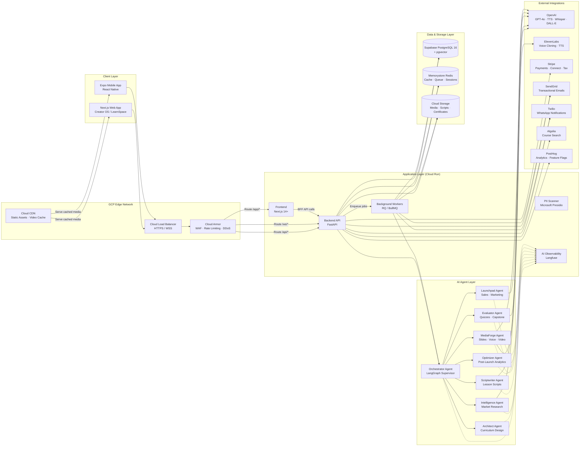
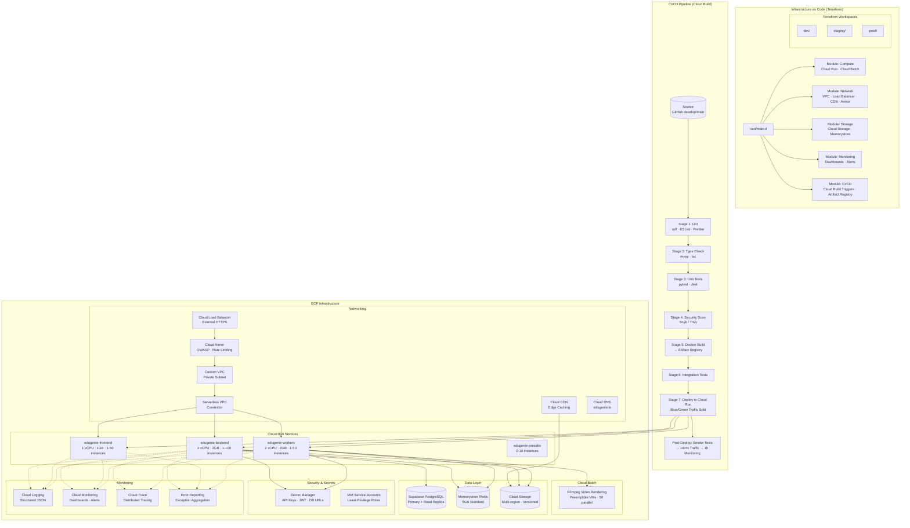
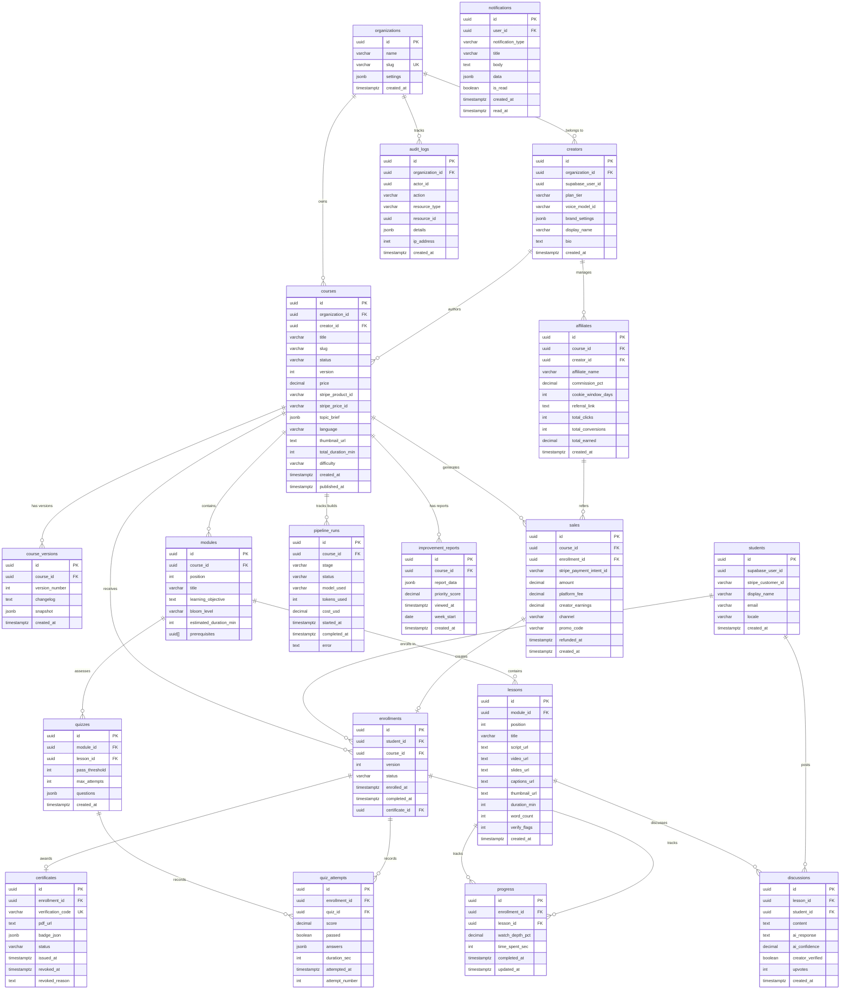

# EduGenie OS — System Architecture

> **Version:** 0.1.0  
> **Last Updated:** 2026-05-26  
> **Stack:** FastAPI · Next.js · Expo · LangChain · LangGraph · Supabase · GCP

---

## Table of Contents

1. [High-Level System Architecture](#1-high-level-system-architecture)
2. [Infrastructure & Deployment Pipeline](#2-infrastructure--deployment-pipeline)
3. [Core AI Workflow](#3-core-ai-workflow)
4. [Database Entity Relationship](#4-database-entity-relationship)
5. [Technology Stack Reference](#5-technology-stack-reference)

---

## 1. High-Level System Architecture

This diagram illustrates the complete network topology — from user-facing clients through GCP's edge network, into the application layer, and out to external integrations.



---

## 2. Infrastructure & Deployment Pipeline

This diagram maps the GCP infrastructure topology (provisioned via Terraform) alongside the Cloud Build CI/CD pipeline that deploys each service.



---

## 3. Core AI Workflow

This sequence diagram traces a complete course build request from the moment a creator submits a topic brief through the AI agent pipeline, review gates, and final publication.

```mermaid
sequenceDiagram
    participant C as Creator (Browser/Mobile)
    participant FE as Next.js Frontend
    participant API as FastAPI Backend
    participant Q as Redis Queue
    participant ORCH as Orchestrator Agent
    participant INTEL as Intelligence Agent
    participant ARCH as Architect Agent
    participant SCRIPT as Scriptwriter Agent
    participant MEDIA as MediaForge Agent
    participant EVAL as Evaluator Agent
    participant LAUNCH as Launchpad Agent
    participant OPT as Optimizer Agent
    participant AI as OpenAI / ElevenLabs
    participant DB as Supabase PostgreSQL
    participant STO as Cloud Storage
    participant EXT as Stripe / SendGrid / Algolia

    C->>FE: Submits topic brief<br/>(topic, audience, depth, tone, language)
    FE->>API: POST /courses/build
    API->>DB: Create course record (status: drafting)
    API->>DB: Create pipeline_run record
    API->>Q: Enqueue pipeline job
    API-->>C: Return job_id (202 Accepted)

    Q->>ORCH: Start pipeline

    rect rgb(240, 245, 255)
        Note over ORCH,INTEL: Stage 1 — Market Intelligence
        ORCH->>INTEL: Run with topic brief
        INTEL->>AI: Web search + competitor analysis
        AI-->>INTEL: Market report + angle recommendations
        INTEL->>DB: Save market report
        INTEL-->>ORCH: Completed
        ORCH-->>API: Stage ready for review
        API-->>C: Notify: "Market research ready"
        C->>API: POST /stages/intelligence/approve
    end

    rect rgb(245, 240, 255)
        Note over ORCH,ARCH: Stage 2 — Curriculum Design
        ORCH->>ARCH: Run with approved brief
        ARCH->>AI: Design curriculum (Bloom's taxonomy)
        AI-->>ARCH: Curriculum JSON (modules, lessons, durations)
        ARCH->>DB: Save modules + lessons
        ARCH-->>ORCH: Completed
        ORCH-->>API: Stage ready for review
        API-->>C: Notify: "Curriculum ready"
        C->>API: POST /stages/architect/approve
    end

    rect rgb(255, 245, 240)
        Note over ORCH,SCRIPT: Stage 3 — Script Writing
        ORCH->>SCRIPT: Run with curriculum
        SCRIPT->>AI: Generate lesson scripts (parallel)
        AI-->>SCRIPT: Full lesson scripts with [VERIFY] flags
        SCRIPT->>STO: Upload scripts
        SCRIPT->>DB: Save script metadata + URLs
        SCRIPT-->>ORCH: Completed
        ORCH-->>API: Stage ready for review
        API-->>C: Notify: "Scripts ready for review"
        C->>API: POST /stages/scriptwriter/approve
    end

    rect rgb(240, 255, 245)
        Note over ORCH,MEDIA: Stage 4 — Media Production
        ORCH->>MEDIA: Run with approved scripts
        MEDIA->>AI: Generate slide content + narration
        MEDIA->>AI: Generate voice narration (TTS)
        MEDIA->>STO: Upload slides (PPTX + PNG)
        MEDIA->>STO: Upload narration (MP3)
        MEDIA->>STO: Render video (FFmpeg → MP4)
        MEDIA->>AI: Generate captions (Whisper → SRT)
        MEDIA->>STO: Upload captions + thumbnail
        MEDIA->>DB: Save media URLs
        MEDIA-->>ORCH: Completed
        ORCH-->>API: Stage ready for review
        API-->>C: Notify: "Media ready for review"
        C->>API: POST /stages/mediaforge/approve
    end

    rect rgb(255, 250, 240)
        Note over ORCH,EVAL: Stage 5 — Assessments
        ORCH->>EVAL: Run with course data
        EVAL->>AI: Generate quizzes + capstone brief
        AI-->>EVAL: Quiz questions + capstone project
        EVAL->>DB: Save quizzes
        EVAL-->>ORCH: Completed
        ORCH-->>API: Stage ready for review
        API-->>C: Notify: "Quizzes ready for review"
        C->>API: POST /stages/evaluator/approve
    end

    rect rgb(245, 245, 255)
        Note over ORCH,LAUNCH: Stage 6 — Launch Preparation
        ORCH->>LAUNCH: Run with full course data
        LAUNCH->>AI: Generate sales page + emails + social posts
        AI-->>LAUNCH: Sales HTML + email sequence + social content
        LAUNCH->>EXT: Stage content (not sent yet)
        LAUNCH-->>ORCH: Completed
        ORCH-->>API: Stage ready for final review
        API-->>C: Notify: "Course ready for final review"
    end

    C->>API: POST /courses/{id}/publish
    API->>EXT: Create Stripe product + price
    API->>EXT: Index course in Algolia
    API->>DB: Update course status (published)
    API->>EXT: Send notification emails
    API-->>C: Return published course URL

    rect rgb(240, 240, 250)
        Note over OPT: Post-Launch (Weekly)
        OPT->>DB: Analyze student engagement data
        OPT->>AI: Generate improvement report
        OPT->>DB: Save improvement report
        OPT-->>API: Notify creator of new report
        API-->>C: "Weekly Optimizer report ready"
    end
```

---

## 4. Database Entity Relationship

This diagram presents the core database schema — the primary tables and their relationships within the Supabase PostgreSQL instance.



---

## 5. Technology Stack Reference

### Backend Services

| Service | Technology | Deployment | Scaling |
|---------|-----------|------------|---------|
| REST API | FastAPI + Pydantic v2 | Cloud Run (2 vCPU, 2GB) | 1–100 instances |
| Background Workers | RQ / BullMQ | Cloud Run (2 vCPU, 2GB) | 1–50 instances |
| Database ORM | SQLAlchemy 2.0 (async) | Supabase PostgreSQL 16 | Primary + Read Replica |
| Migrations | Alembic | Cloud Build step | — |
| Cache / Queue | Redis via Memorystore | 5GB Standard | Replicated |

### AI & Machine Learning

| Component | Provider | Model / Service |
|-----------|----------|-----------------|
| Text Generation | OpenAI | GPT-4o (primary), GPT-4o-mini (cost-optimized) |
| Text Generation (Fallback) | Anthropic | Claude |
| Embeddings | OpenAI | text-embedding-3-small (1536d) |
| Speech-to-Text | OpenAI | Whisper API |
| Text-to-Speech | OpenAI / ElevenLabs | TTS API / Voice Cloning |
| Image Generation | OpenAI / Ideogram | DALL-E 3 |
| Agent Orchestration | LangChain | LangGraph Supervisor |
| Observability | Langfuse | Self-hosted on Cloud Run |
| PII Detection | Microsoft Presidio | Self-hosted on Cloud Run |
| Plagiarism | Originality.ai | API |

### Frontend & Mobile

| Platform | Framework | State Management | Deployment |
|----------|-----------|-----------------|------------|
| Creator OS (Web) | Next.js 14+ (App Router) | Zustand + TanStack Query | Cloud Run |
| LearnSpace (Web) | Next.js 14+ (App Router) | Zustand + TanStack Query | Cloud Run |
| Mobile App | React Native + Expo SDK 52+ | Zustand + TanStack Query | EAS Build → App Store/Play |

### Third-Party Integrations

| Service | Purpose | Webhook |
|---------|---------|---------|
| Stripe | Payments, Connect, Tax | `POST /webhooks/stripe` |
| SendGrid | Transactional emails | `POST /webhooks/sendgrid` |
| Twilio | WhatsApp notifications | `POST /webhooks/twilio` |
| Algolia | Course search indexing | — |
| PostHog | Product analytics, feature flags | — |

### GCP Infrastructure

| Component | Configuration |
|-----------|---------------|
| Compute | Cloud Run (auto-scale, CPU > 65%) |
| Video Rendering | Cloud Batch (preemptible VMs, 50 parallel) |
| Storage | Cloud Storage (multi-region, versioned) |
| CDN | Cloud CDN (edge caching, signed URLs) |
| Networking | Custom VPC, Serverless VPC Connector |
| Security | Cloud Armor (OWASP, rate limiting) |
| Secrets | Secret Manager (auto-rotation) |
| Monitoring | Cloud Logging + Monitoring + Trace |
| CI/CD | Cloud Build → Artifact Registry → Cloud Run |
| IaC | Terraform (workspaces: dev, staging, prod) |
