# EduGenie OS — Database Schema

> **Version:** 0.2.0  
> **Engine:** Supabase PostgreSQL 16 + pgvector  
> **ORM:** SQLAlchemy 2.0 async  
> **Last Updated:** 2026-05-27

---

## Table of Contents

1. [Entity Relationship Diagram](#1-entity-relationship-diagram)
2. [Table Definitions (DDL)](#2-table-definitions-ddl)
3. [Vector Embeddings (pgvector)](#3-vector-embeddings-pgvector)
4. [Row-Level Security Policies](#4-row-level-security-policies)
5. [Indexes & Performance](#5-indexes--performance)
6. [Migrations Strategy](#6-migrations-strategy)

---

## 1. Entity Relationship Diagram

```mermaid
erDiagram
    organizations ||--o{ creators : "belongs to"
    organizations ||--o{ courses : "owns"
    organizations ||--o{ audit_logs : "tracks"

    creators ||--o{ courses : "authors"
    creators ||--o{ affiliates : "manages"

    courses ||--o{ course_versions : "has versions"
    courses ||--o{ modules : "contains"
    courses ||--o{ enrollments : "receives"
    courses ||--o{ sales : "generates"
    courses ||--o{ pipeline_runs : "tracks builds"
    courses ||--o{ improvement_reports : "has reports"

    modules ||--o{ lessons : "contains"
    modules ||--o{ quizzes : "assesses"

    lessons ||--o{ progress : "tracks"
    lessons ||--o{ discussions : "discusses"

    quizzes ||--o{ quiz_attempts : "records"

    students ||--o{ enrollments : "enrolls in"
    students ||--o{ discussions : "posts"

    enrollments ||--o{ progress : "tracks"
    enrollments ||--o{ quiz_attempts : "records"
    enrollments ||--o| certificates : "awards"

    sales ||--o| enrollments : "creates"
    affiliates ||--o{ sales : "refers"
```



---

## 2. Table Definitions (DDL)

### Enable Extensions

```sql
CREATE EXTENSION IF NOT EXISTS "pgvector";
CREATE EXTENSION IF NOT EXISTS "uuid-ossp";
CREATE EXTENSION IF NOT EXISTS "pgcrypto";
```

### organizations

Multi-tenant root. Every creator, course, and student belongs to one organization.

```sql
CREATE TABLE organizations (
    id          UUID PRIMARY KEY DEFAULT gen_random_uuid(),
    name        VARCHAR(255) NOT NULL,
    slug        VARCHAR(100) UNIQUE NOT NULL,
    settings    JSONB DEFAULT '{}'::jsonb,
    created_at  TIMESTAMPTZ NOT NULL DEFAULT NOW()
);
```

### creators

Profile and subscription data for course authors.

```sql
CREATE TABLE creators (
    id                UUID PRIMARY KEY DEFAULT gen_random_uuid(),
    organization_id   UUID NOT NULL REFERENCES organizations(id) ON DELETE CASCADE,
    supabase_user_id  UUID UNIQUE NOT NULL,
    plan_tier         VARCHAR(20) NOT NULL DEFAULT 'starter'
                      CHECK (plan_tier IN ('starter', 'creator', 'studio', 'enterprise')),
    voice_model_id    VARCHAR(100),
    brand_settings    JSONB DEFAULT '{}'::jsonb,
    display_name      VARCHAR(255),
    bio               TEXT,
    created_at        TIMESTAMPTZ NOT NULL DEFAULT NOW()
);

CREATE INDEX idx_creators_org ON creators(organization_id);
```

### courses

Core product entity. Stores metadata, pricing, and Stripe references.

```sql
CREATE TABLE courses (
    id                  UUID PRIMARY KEY DEFAULT gen_random_uuid(),
    organization_id     UUID NOT NULL REFERENCES organizations(id) ON DELETE CASCADE,
    creator_id          UUID NOT NULL REFERENCES creators(id) ON DELETE CASCADE,
    title               VARCHAR(255) NOT NULL,
    slug                VARCHAR(280) UNIQUE NOT NULL,
    status              VARCHAR(20) NOT NULL DEFAULT 'draft'
                        CHECK (status IN ('draft', 'building', 'review', 'published', 'archived')),
    version             INTEGER NOT NULL DEFAULT 1,
    price               DECIMAL(10,2) NOT NULL DEFAULT 0,
    stripe_product_id   VARCHAR(100),
    stripe_price_id     VARCHAR(100),
    topic_brief         JSONB NOT NULL,
    language            VARCHAR(10) NOT NULL DEFAULT 'en',
    thumbnail_url       TEXT,
    total_duration_min  INTEGER DEFAULT 0,
    difficulty          VARCHAR(20) DEFAULT 'beginner'
                        CHECK (difficulty IN ('beginner', 'intermediate', 'advanced')),
    created_at          TIMESTAMPTZ NOT NULL DEFAULT NOW(),
    published_at        TIMESTAMPTZ
);

CREATE INDEX idx_courses_creator ON courses(creator_id);
CREATE INDEX idx_courses_status ON courses(status) WHERE status = 'published';
CREATE INDEX idx_courses_language ON courses(language);
```

### course_versions

Immutable version history. Enables rollback and selective regeneration.

```sql
CREATE TABLE course_versions (
    id              UUID PRIMARY KEY DEFAULT gen_random_uuid(),
    course_id       UUID NOT NULL REFERENCES courses(id) ON DELETE CASCADE,
    version_number  INTEGER NOT NULL,
    changelog       TEXT,
    snapshot        JSONB NOT NULL,
    created_at      TIMESTAMPTZ NOT NULL DEFAULT NOW(),
    UNIQUE(course_id, version_number)
);
```

### modules

Curriculum building block.

```sql
CREATE TABLE modules (
    id                      UUID PRIMARY KEY DEFAULT gen_random_uuid(),
    course_id               UUID NOT NULL REFERENCES courses(id) ON DELETE CASCADE,
    position                INTEGER NOT NULL,
    title                   VARCHAR(255) NOT NULL,
    learning_objective      TEXT,
    bloom_level             VARCHAR(20) DEFAULT 'remember'
                            CHECK (bloom_level IN ('remember', 'understand', 'apply',
                                                   'analyze', 'evaluate', 'create')),
    estimated_duration_min  INTEGER DEFAULT 30,
    prerequisites           UUID[] DEFAULT ARRAY[]::UUID[],
    UNIQUE(course_id, position)
);

CREATE INDEX idx_modules_course ON modules(course_id);
```

### lessons

Media-rich lesson with all asset URLs stored in Supabase Storage.

```sql
CREATE TABLE lessons (
    id              UUID PRIMARY KEY DEFAULT gen_random_uuid(),
    module_id       UUID NOT NULL REFERENCES modules(id) ON DELETE CASCADE,
    position        INTEGER NOT NULL,
    title           VARCHAR(255) NOT NULL,
    script_url      TEXT,          -- Supabase Storage URL
    video_url       TEXT,          -- Supabase Storage URL
    slides_url      TEXT,          -- Supabase Storage URL
    captions_url    TEXT,          -- Supabase Storage URL
    thumbnail_url   TEXT,
    duration_min    INTEGER DEFAULT 10,
    word_count      INTEGER DEFAULT 0,
    verify_flags    INTEGER DEFAULT 0,  -- bitmask: bits = [VERIFY] flags to resolve
    created_at      TIMESTAMPTZ NOT NULL DEFAULT NOW(),
    UNIQUE(module_id, position)
);

CREATE INDEX idx_lessons_module ON lessons(module_id);
```

### quizzes

Per-module or per-lesson assessments. Questions stored as JSONB for flexibility.

```sql
CREATE TABLE quizzes (
    id              UUID PRIMARY KEY DEFAULT gen_random_uuid(),
    module_id       UUID REFERENCES modules(id) ON DELETE CASCADE,
    lesson_id       UUID REFERENCES lessons(id) ON DELETE CASCADE,
    pass_threshold  INTEGER NOT NULL DEFAULT 70
                    CHECK (pass_threshold BETWEEN 0 AND 100),
    max_attempts    INTEGER NOT NULL DEFAULT 3,
    questions       JSONB NOT NULL DEFAULT '[]'::jsonb,
    created_at      TIMESTAMPTZ NOT NULL DEFAULT NOW(),
    CHECK (module_id IS NOT NULL OR lesson_id IS NOT NULL)
);

CREATE INDEX idx_quizzes_module ON quizzes(module_id);
```

The `questions` JSONB follows this structure:

```json
[
  {
    "id": "q1",
    "type": "multiple_choice",
    "question": "What is...?",
    "options": ["A", "B", "C", "D"],
    "correct_index": 0,
    "explanation": "Because..."
  },
  {
    "id": "q2",
    "type": "true_false",
    "question": "Is...?",
    "correct_answer": true,
    "explanation": "..."
  }
]
```

### students

Learner identity. Linked to Supabase Auth and Stripe.

```sql
CREATE TABLE students (
    id                  UUID PRIMARY KEY DEFAULT gen_random_uuid(),
    supabase_user_id    UUID UNIQUE NOT NULL,
    stripe_customer_id  VARCHAR(100),
    display_name        VARCHAR(255),
    email               VARCHAR(255),
    locale              VARCHAR(10) DEFAULT 'en',
    created_at          TIMESTAMPTZ NOT NULL DEFAULT NOW()
);

CREATE INDEX idx_students_email ON students(email);
```

### enrollments

Student ↔ Course mapping with progress and certificate tracking.

```sql
CREATE TABLE enrollments (
    id              UUID PRIMARY KEY DEFAULT gen_random_uuid(),
    student_id      UUID NOT NULL REFERENCES students(id) ON DELETE CASCADE,
    course_id       UUID NOT NULL REFERENCES courses(id) ON DELETE CASCADE,
    version         INTEGER NOT NULL DEFAULT 1,
    status          VARCHAR(20) NOT NULL DEFAULT 'active'
                    CHECK (status IN ('active', 'completed', 'refunded')),
    enrolled_at     TIMESTAMPTZ NOT NULL DEFAULT NOW(),
    completed_at    TIMESTAMPTZ,
    certificate_id  UUID,
    UNIQUE(student_id, course_id)
);

CREATE INDEX idx_enrollments_student ON enrollments(student_id);
CREATE INDEX idx_enrollments_course  ON enrollments(course_id);
```

### progress

Per-lesson granular progress — watch depth, time spent, completion timestamp.

```sql
CREATE TABLE progress (
    id              UUID PRIMARY KEY DEFAULT gen_random_uuid(),
    enrollment_id   UUID NOT NULL REFERENCES enrollments(id) ON DELETE CASCADE,
    lesson_id       UUID NOT NULL REFERENCES lessons(id) ON DELETE CASCADE,
    watch_depth_pct DECIMAL(5,2) DEFAULT 0 CHECK (watch_depth_pct BETWEEN 0 AND 100),
    time_spent_sec  INTEGER DEFAULT 0,
    completed_at    TIMESTAMPTZ,
    updated_at      TIMESTAMPTZ NOT NULL DEFAULT NOW(),
    UNIQUE(enrollment_id, lesson_id)
);

CREATE INDEX idx_progress_enrollment ON progress(enrollment_id);
```

### quiz_attempts

Records every quiz submission with answers and score.

```sql
CREATE TABLE quiz_attempts (
    id              UUID PRIMARY KEY DEFAULT gen_random_uuid(),
    enrollment_id   UUID NOT NULL REFERENCES enrollments(id) ON DELETE CASCADE,
    quiz_id         UUID NOT NULL REFERENCES quizzes(id) ON DELETE CASCADE,
    score           DECIMAL(5,2) CHECK (score BETWEEN 0 AND 100),
    passed          BOOLEAN DEFAULT FALSE,
    answers         JSONB NOT NULL,
    duration_sec    INTEGER DEFAULT 0,
    attempt_number  INTEGER NOT NULL,
    attempted_at    TIMESTAMPTZ NOT NULL DEFAULT NOW(),
    UNIQUE(enrollment_id, quiz_id, attempt_number)
);

CREATE INDEX idx_quiz_attempts_enrollment ON quiz_attempts(enrollment_id);
```

### sales

Payment records linking Stripe PaymentIntents to courses and affiliates.

```sql
CREATE TABLE sales (
    id                      UUID PRIMARY KEY DEFAULT gen_random_uuid(),
    course_id               UUID NOT NULL REFERENCES courses(id) ON DELETE CASCADE,
    enrollment_id           UUID REFERENCES enrollments(id),
    stripe_payment_intent_id VARCHAR(100) UNIQUE NOT NULL,
    amount                  DECIMAL(10,2) NOT NULL,
    platform_fee            DECIMAL(10,2) DEFAULT 0,
    creator_earnings        DECIMAL(10,2) DEFAULT 0,
    channel                 VARCHAR(20) DEFAULT 'direct'
                            CHECK (channel IN ('direct', 'affiliate', 'promo')),
    promo_code              VARCHAR(50),
    refunded_at             TIMESTAMPTZ,
    created_at              TIMESTAMPTZ NOT NULL DEFAULT NOW()
);

CREATE INDEX idx_sales_course ON sales(course_id);
CREATE INDEX idx_sales_stripe ON sales(stripe_payment_intent_id);
```

### affiliates

Creator-managed referral links with commission tracking.

```sql
CREATE TABLE affiliates (
    id                  UUID PRIMARY KEY DEFAULT gen_random_uuid(),
    course_id           UUID NOT NULL REFERENCES courses(id) ON DELETE CASCADE,
    creator_id          UUID NOT NULL REFERENCES creators(id) ON DELETE CASCADE,
    affiliate_name      VARCHAR(255),
    commission_pct      DECIMAL(5,2) NOT NULL DEFAULT 10
                        CHECK (commission_pct BETWEEN 0 AND 100),
    cookie_window_days  INTEGER NOT NULL DEFAULT 30,
    referral_link       TEXT NOT NULL,
    total_clicks        INTEGER DEFAULT 0,
    total_conversions   INTEGER DEFAULT 0,
    total_earned        DECIMAL(10,2) DEFAULT 0,
    created_at          TIMESTAMPTZ NOT NULL DEFAULT NOW(),
    UNIQUE(course_id, creator_id)
);

CREATE INDEX idx_affiliates_course ON affiliates(course_id);
```

### certificates

Auto-generated on course completion. Public verification via unique code.

```sql
CREATE TABLE certificates (
    id                  UUID PRIMARY KEY DEFAULT gen_random_uuid(),
    enrollment_id       UUID UNIQUE NOT NULL REFERENCES enrollments(id) ON DELETE CASCADE,
    verification_code   VARCHAR(20) UNIQUE NOT NULL DEFAULT encode(gen_random_bytes(10), 'hex'),
    pdf_url             TEXT,
    badge_json          JSONB,
    status              VARCHAR(20) NOT NULL DEFAULT 'active'
                        CHECK (status IN ('active', 'revoked')),
    issued_at           TIMESTAMPTZ NOT NULL DEFAULT NOW(),
    revoked_at          TIMESTAMPTZ,
    revoked_reason      TEXT
);

CREATE INDEX idx_certificates_verify ON certificates(verification_code);
```

### discussions

Per-lesson Q&A with AI-generated response suggestions.

```sql
CREATE TABLE discussions (
    id                UUID PRIMARY KEY DEFAULT gen_random_uuid(),
    lesson_id         UUID NOT NULL REFERENCES lessons(id) ON DELETE CASCADE,
    student_id        UUID NOT NULL REFERENCES students(id) ON DELETE CASCADE,
    content           TEXT NOT NULL,
    ai_response       TEXT,
    ai_confidence     DECIMAL(5,2),
    creator_verified  BOOLEAN DEFAULT FALSE,
    upvotes           INTEGER DEFAULT 0,
    created_at        TIMESTAMPTZ NOT NULL DEFAULT NOW()
);

CREATE INDEX idx_discussions_lesson ON discussions(lesson_id);
```

### pipeline_runs

Tracks every AI pipeline execution for cost and performance monitoring.

```sql
CREATE TABLE pipeline_runs (
    id              UUID PRIMARY KEY DEFAULT gen_random_uuid(),
    course_id       UUID NOT NULL REFERENCES courses(id) ON DELETE CASCADE,
    stage           VARCHAR(30) NOT NULL
                    CHECK (stage IN ('intelligence', 'architect', 'scriptwriter',
                                     'mediaforge', 'evaluator', 'launchpad', 'optimizer')),
    status          VARCHAR(20) NOT NULL DEFAULT 'pending'
                    CHECK (status IN ('pending', 'running', 'completed', 'failed', 'skipped')),
    model_used      VARCHAR(50),
    tokens_used     INTEGER DEFAULT 0,
    cost_usd        DECIMAL(10,6) DEFAULT 0,
    started_at      TIMESTAMPTZ,
    completed_at    TIMESTAMPTZ,
    error           TEXT,
    PRIMARY KEY (id, stage)
);

CREATE INDEX idx_pipeline_runs_course ON pipeline_runs(course_id);
```

### improvement_reports

Weekly Optimizer Agent output with prioritized recommendations.

```sql
CREATE TABLE improvement_reports (
    id              UUID PRIMARY KEY DEFAULT gen_random_uuid(),
    course_id       UUID NOT NULL REFERENCES courses(id) ON DELETE CASCADE,
    report_data     JSONB NOT NULL,
    priority_score  DECIMAL(5,2) DEFAULT 0,
    viewed_at       TIMESTAMPTZ,
    week_start      DATE NOT NULL,
    created_at      TIMESTAMPTZ NOT NULL DEFAULT NOW(),
    UNIQUE(course_id, week_start)
);

CREATE INDEX idx_improvement_reports_course ON improvement_reports(course_id);
```

### notifications

In-app and push notification queue. Read/unread with contextual JSONB data.

```sql
CREATE TABLE notifications (
    id                  UUID PRIMARY KEY DEFAULT gen_random_uuid(),
    user_id             UUID NOT NULL,
    notification_type   VARCHAR(50) NOT NULL,
    title               VARCHAR(200) NOT NULL,
    body                TEXT,
    data                JSONB DEFAULT '{}'::jsonb,
    is_read             BOOLEAN DEFAULT FALSE,
    created_at          TIMESTAMPTZ NOT NULL DEFAULT NOW(),
    read_at             TIMESTAMPTZ
);

CREATE INDEX idx_notifications_user_unread
    ON notifications(user_id, is_read)
    WHERE NOT is_read;
```

### audit_logs

Immutable append-only log for compliance and debugging.

```sql
CREATE TABLE audit_logs (
    id              UUID PRIMARY KEY DEFAULT gen_random_uuid(),
    organization_id UUID NOT NULL REFERENCES organizations(id) ON DELETE CASCADE,
    actor_id        UUID NOT NULL,
    action          VARCHAR(100) NOT NULL,
    resource_type   VARCHAR(50) NOT NULL,
    resource_id     UUID,
    details         JSONB DEFAULT '{}'::jsonb,
    ip_address      INET,
    created_at      TIMESTAMPTZ NOT NULL DEFAULT NOW()
);

CREATE INDEX idx_audit_logs_org      ON audit_logs(organization_id);
CREATE INDEX idx_audit_logs_created  ON audit_logs(created_at);
```

---

## 3. Vector Embeddings (pgvector)

### Embedding Model

| Property | Value |
|----------|-------|
| Provider | Google Gemini |
| Model | Gemini Embedding 2 |
| Dimensions | 1536 |
| Storage | pgvector column on Supabase PostgreSQL 16 |

### Embeddings Table

Stores vector representations for similarity search across use cases.

```sql
CREATE TYPE embedding_scope AS ENUM (
    'research_cache',     -- Intelligence Agent dedup by (topic_hash, date)
    'curriculum_pattern', -- High-completion curriculum matching
    'content_similarity', -- Plagiarism baseline
    'learner_signal'      -- Confusion clustering
);

CREATE TABLE embeddings (
    id          UUID PRIMARY KEY DEFAULT gen_random_uuid(),
    scope       embedding_scope NOT NULL,
    source_id   UUID NOT NULL,          -- FK to the source row
    source_type VARCHAR(50) NOT NULL,   -- table name: 'courses', 'lessons', 'discussions'
    content     TEXT,                   -- original text for reference
    vector      VECTOR(1536) NOT NULL,
    metadata    JSONB DEFAULT '{}'::jsonb,
    created_at  TIMESTAMPTZ NOT NULL DEFAULT NOW()
);

-- IVFFlat index for approximate nearest neighbor search
CREATE INDEX idx_embeddings_vector
    ON embeddings
    USING ivfflat (vector vector_cosine_ops)
    WITH (lists = 100);

-- Scope + source for fast lookup
CREATE INDEX idx_embeddings_scope ON embeddings(scope, source_id);
```

### Hybrid Search Query

Combines vector similarity with BM25-style text weighting:

```sql
WITH vector_scores AS (
    SELECT
        source_id,
        source_type,
        1 - (vector <=> query_embedding) AS vector_score
    FROM embeddings
    WHERE scope = 'marketplace_search'
    ORDER BY vector_score DESC
    LIMIT 50
),
text_scores AS (
    SELECT
        source_id,
        ts_rank(to_tsvector('english', content), plainto_tsquery('english', 'search terms')) AS text_score
    FROM embeddings
    WHERE scope = 'marketplace_search'
)
SELECT
    COALESCE(v.source_id, t.source_id) AS source_id,
    COALESCE(v.vector_score * 0.65, 0) + COALESCE(t.text_score * 0.35, 0) AS hybrid_score
FROM vector_scores v
FULL OUTER JOIN text_scores t ON v.source_id = t.source_id
ORDER BY hybrid_score DESC
LIMIT 20;
```

---

## 4. Row-Level Security Policies

Supabase RLS enforces multi-tenant isolation at the database level.

### Enable RLS on All Tables

```sql
ALTER TABLE organizations ENABLE ROW LEVEL SECURITY;
ALTER TABLE creators       ENABLE ROW LEVEL SECURITY;
ALTER TABLE courses        ENABLE ROW LEVEL SECURITY;
ALTER TABLE modules        ENABLE ROW LEVEL SECURITY;
ALTER TABLE lessons        ENABLE ROW LEVEL SECURITY;
ALTER TABLE quizzes        ENABLE ROW LEVEL SECURITY;
ALTER TABLE students       ENABLE ROW LEVEL SECURITY;
ALTER TABLE enrollments    ENABLE ROW LEVEL SECURITY;
ALTER TABLE progress       ENABLE ROW LEVEL SECURITY;
ALTER TABLE quiz_attempts  ENABLE ROW LEVEL SECURITY;
ALTER TABLE sales          ENABLE ROW LEVEL SECURITY;
ALTER TABLE affiliates     ENABLE ROW LEVEL SECURITY;
ALTER TABLE certificates   ENABLE ROW LEVEL SECURITY;
ALTER TABLE discussions    ENABLE ROW LEVEL SECURITY;
ALTER TABLE pipeline_runs  ENABLE ROW LEVEL SECURITY;
ALTER TABLE audit_logs     ENABLE ROW LEVEL SECURITY;
ALTER TABLE notifications  ENABLE ROW LEVEL SECURITY;
ALTER TABLE embeddings     ENABLE ROW LEVEL SECURITY;
```

### Policy Definitions

```sql
-- ── organizations ─────────────────────────────────────
-- Users see only their own org
CREATE POLICY org_isolation ON organizations
    USING (id = current_setting('app.organization_id')::UUID);

-- ── creators ──────────────────────────────────────────
-- Creators see own profile; org admins see all
CREATE POLICY creator_self ON creators
    USING (supabase_user_id = auth.uid());

-- ── courses ───────────────────────────────────────────
-- Published courses are public; draft/building are creator-only
CREATE POLICY courses_public ON courses
    FOR SELECT
    USING (status = 'published');

CREATE POLICY courses_creator ON courses
    USING (creator_id IN (
        SELECT id FROM creators WHERE supabase_user_id = auth.uid()
    ));

-- ── students ──────────────────────────────────────────
-- Students see own profile only
CREATE POLICY student_self ON students
    USING (supabase_user_id = auth.uid());

-- ── enrollments ────────────────────────────────────────
-- Students see own enrollments
CREATE POLICY enrollment_self ON enrollments
    USING (student_id IN (
        SELECT id FROM students WHERE supabase_user_id = auth.uid()
    ));

-- ── notifications ─────────────────────────────────────
-- Users see own notifications
CREATE POLICY notification_self ON notifications
    USING (user_id = auth.uid());

-- ── audit_logs ────────────────────────────────────────
-- Append-only: INSERT allowed, SELECT by org admins only
CREATE POLICY audit_append ON audit_logs
    FOR INSERT
    WITH CHECK (organization_id = current_setting('app.organization_id')::UUID);

-- ── embeddings ────────────────────────────────────────
-- Read-only for most users; insert by AI agents
CREATE POLICY embeddings_read ON embeddings
    FOR SELECT
    USING (true);
```

---

## 5. Indexes & Performance

### Index Inventory

| Table | Index | Type | Column(s) | Purpose |
|-------|-------|------|-----------|---------|
| creators | idx_creators_org | B-tree | organization_id | Tenant filtering |
| courses | idx_courses_creator | B-tree | creator_id | Creator dashboard |
| courses | idx_courses_status | Partial B-tree | status WHERE published | Marketplace listing |
| courses | idx_courses_language | B-tree | language | Multi-language filter |
| modules | idx_modules_course | B-tree | course_id | Curriculum load |
| lessons | idx_lessons_module | B-tree | module_id | Lesson list |
| enrollments | idx_enrollments_student | B-tree | student_id | My courses |
| enrollments | idx_enrollments_course | B-tree | course_id | Enrollment count |
| notifications | idx_notifications_user_unread | Partial B-tree | user_id, is_read | Unread badge |
| audit_logs | idx_audit_logs_org | B-tree | organization_id | Compliance export |
| audit_logs | idx_audit_logs_created | B-tree | created_at | Time-range queries |
| pipeline_runs | idx_pipeline_runs_course | B-tree | course_id | Pipeline status |
| embeddings | idx_embeddings_vector | IVFFlat | vector | ANN search |
| embeddings | idx_embeddings_scope | B-tree | scope, source_id | Scope filtering |
| sales | idx_sales_course | B-tree | course_id | Revenue aggregation |
| sales | idx_sales_stripe | B-tree | stripe_payment_intent_id | Webhook dedup |
| certificates | idx_certificates_verify | B-tree | verification_code | Public verification |
| quiz_attempts | idx_quiz_attempts_enrollment | B-tree | enrollment_id | Quiz history |
| affiliates | idx_affiliates_course | B-tree | course_id | Affiliate links |
| discussions | idx_discussions_lesson | B-tree | lesson_id | Lesson Q&A |
| improvement_reports | idx_improvement_reports_course | B-tree | course_id | Report history |

### Performance Guidelines

| Pattern | Guideline |
|---------|-----------|
| Connection Pool | PgBouncer — transaction mode, pool size = 20 per service instance |
| Read Replicas | Route analytics/report queries to read replica |
| JSONB Queries | Use `@>` containment operator + GIN index on frequently-queried paths |
| Full-Text Search | Use `to_tsvector`/`to_tsquery` with GIN index instead of `LIKE '%...%'` |
| Vector Search | IVFFlat with `lists = sqrt(n_rows)` — rebuild after 10% data growth |
| Soft Deletes | Use `status = 'archived'` pattern; hard delete only for PII erasure |
| Batch Inserts | Use `INSERT INTO ... VALUES (...), (...)` — max 1000 rows per statement |

---

## 6. Migrations Strategy

### Workflow

```bash
# Create a new migration
cd backend
alembic revision --autogenerate -m "add_quiz_difficulty_column"

# Review generated migration in alembic/versions/
# Always verify autogenerated code — column types, defaults, indexes

# Apply
alembic upgrade head

# Rollback (last migration only)
alembic downgrade -1
```

### Rules

| Rule | Description |
|------|-------------|
| Additive-only | New columns must be NULLABLE or have a DEFAULT. No ALTER COLUMN DROP NOT NULL in same release. |
| Destructive changes | Dual-write period for 2 releases before dropping columns. Rollback script required. |
| CI/CD integration | Migrations run as a GitHub Actions step after tests pass, before deploy. |
| No auto-migrations in prod | Autogenerate is a starting point. All production migrations are reviewed manually. |
| Data migrations | Use separate migration files. Never mix DDL and DML in the same revision. |
